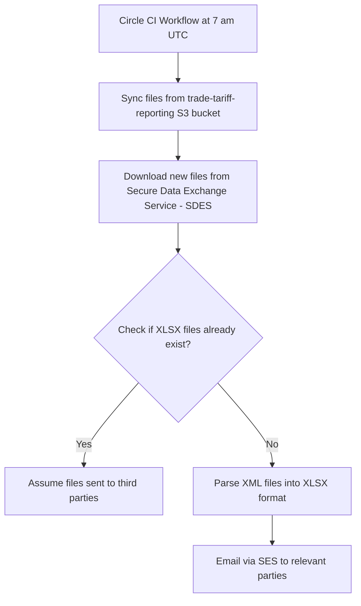

# download-CDS-files

This project downloads files containing tariff information and extracts them
into a human-readable XLSX format.

These files are subsequently emailed to various stakeholders as part of a service run
by the Online Trade Tariff team.

The following is a flowchart of the process



## Getting started for local development

```bash
python -m venv venv # Build an isolated python dev environment
source venv/bin/activate # Activate the enviornment
pip install -r requirements_dev.txt # Install dependencies into the environment
cp .env.example .env # Copy the example .env file to configure the project
```

Once you've copied the example configuration file, you'll want help from the team to populate the secrets
in your local copy of the .env file.

Please make sure you **never upload secrets to github**.

You should then be able to download the CDS files and email parsed changes like so:

```bash
python download.py
python parse.py
```

## Prerequisites

- python (specific version is defined in .tool-versions)
- aws access (speak to a team member)
- secrets for interfacing with the cds api (speak to a team member)
