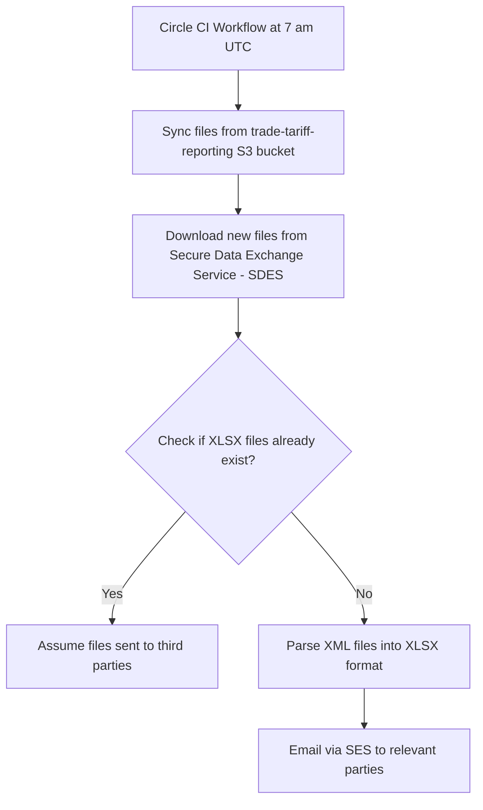

# download-CDS-files

This project downloads files containing tariff information and extracts them
into a human-readable XLSX format.

These files are subsequently emailed to various stakeholders as part of a service run
by the Online Trade Tariff team.

The following is a flowchart of the process



## Dependency Management

We use `pip-tools` for dependency management with:

- requirements.in - Main production dependencies
- requirements_dev.in - Development tools and testing dependencies

To update dependencies:

```bash
pip-compile requirements.in  # Generates requirements.txt
pip-compile requirements_dev.in  # Generates requirements_dev.txt
pip-sync requirements.txt requirements_dev.txt  # Syncs your environment
```

## Getting started for local development

```bash
python -m venv venv  # Create isolated Python environment
source venv/bin/activate  # Activate environment

# First time setup
pip install pip-tools  # Install dependency management tools
pip-compile requirements.in  # Generate requirements.txt
pip-compile requirements_dev.in  # Generate requirements_dev.txt
pip-sync requirements.txt requirements_dev.txt  # Install all dependencies

cp .env.example .env # Copy the example .env file to configure the project
```

Once you've copied the example configuration file, you'll want help from the team to populate the secrets
in your local copy of the .env file.

Please make sure you **never upload secrets to github**.

You should then be able to download the CDS files and email parsed changes like so:

```bash
python download.py
python parse.py
```

## Prerequisites

- python (specific version is defined in .tool-versions)
- aws access (speak to a team member)
- secrets for interfacing with the cds api (speak to a team member)

## Deployment Notes

1. The GitHub Actions workflow automatically:
2. Compiles .in files to .txt during CI
3. Installs system dependencies
4. Runs with retry logic for reliability
