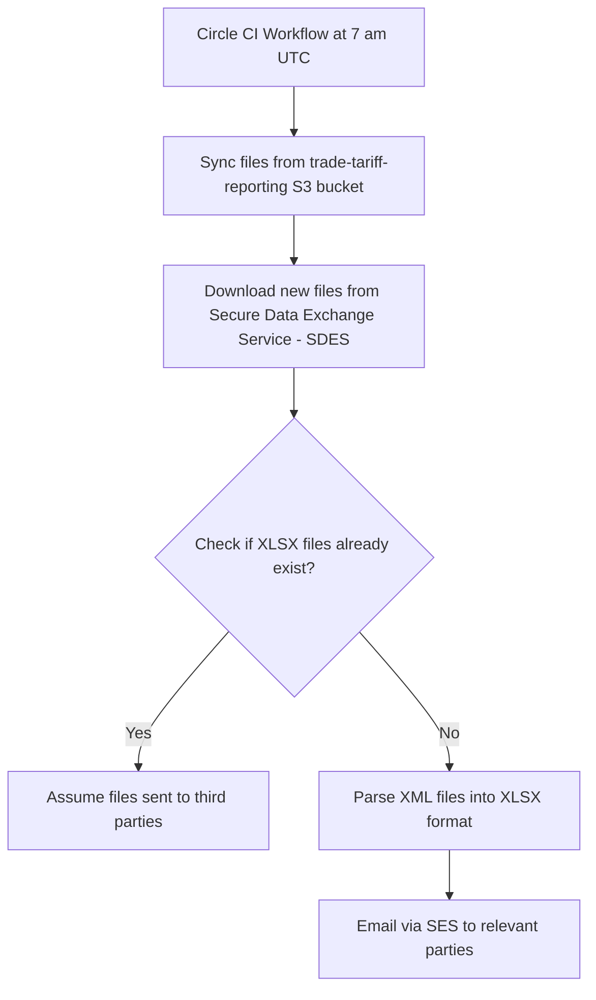

# download-CDS-files

This project downloads files containing tariff information and extracts them
into a human-readable XLSX format.

These files are subsequently emailed to various stakeholders as part of a service run
by the Online Trade Tariff team.

The following is a flowchart of the process



## Dependency Management

We use `pip-tools` to manage Python dependencies in a reliable and reproducible way. Flexible dependency specifications are declared in `.in` files, and fully pinned `.txt` lock files are automatically generated and used during runtime.

Each time the workflow runs, it compiles the `.txt` files with the latest compatible versions, ensuring up-to-date environments without manual intervention.

### How it works

1. Define top-level dependencies in `requirements.in` and `requirements_dev.in` using loose version specs (e.g., `requests`, `requests>=2.25.0`).
2. Run pip-compile to resolve and pin all dependencies into `requirements.txt` and `requirements_dev.txt`.
3. Use `pip-sync` to install exactly what’s listed in the `.txt` files—no more, no less.

To update dependencies:

```bash
pip-compile --upgrade --output-file=requirements.txt requirements.in  # Generates requirements.txt
pip-compile --upgrade --output-file=requirements_dev.txt requirements_dev.in  # Generates requirements_dev.txt
pip-sync requirements.txt requirements_dev.txt  # Syncs your environment
```

## Getting started for local development

```bash
python -m venv venv  # Create isolated Python environment
source venv/bin/activate  # Activate environment

# First time setup
pip install pip-tools  # Install dependency management tools
pip-compile requirements.in  # Generate requirements.txt
pip-compile requirements_dev.in  # Generate requirements_dev.txt
pip-sync requirements.txt requirements_dev.txt  # Install all dependencies
cp .env.example .env # Copy the example .env file to configure the project
```

Once you've copied the example configuration file, you'll want help from the team to populate the secrets
in your local copy of the .env file.

Please make sure you **never upload secrets to github**.

You should then be able to download the CDS files and email parsed changes like so:

```bash
python download.py
python parse.py
```

## Prerequisites

- python (specific version is defined in .tool-versions)
- aws access (speak to a team member)
- secrets for interfacing with the cds api (speak to a team member)
